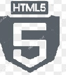

<!--  -->
<!--  -->


<!-- 
 -->

<!--  -->


## Full Stack JavaScript Boot Camp 2.0

<!-- ##  -->

### 💻 Languages Used 


  

<!-- [](https://github.com/radhimaa/FullStack-JavaScript-BC-2)

[](https://github.com/radhimaa/FullStack-JavaScript-BC-2) -->


<!-- [](https://github.com/radhimaa/github-readme-stats) -->

<!--  -->
<!-- 
 -->

<!-- [](https://github.com/radhimaa/github-readme-stats) -->


<br>
11-05-22 : [Introduction to Web and Html](https://fsjsv2assignmentsineuron.hashnode.dev/introduction-to-web-and-html) 
<br>
11-06-22 : [HTML's Audio and Video Elements](https://fsjsv2assignmentsineuron.hashnode.dev/html-audio-and-video-elements)[  **Example link**](https://codepen.io/radhimaa/pen/GRBJQKy)
<br>
11-06-22 : [HTML's Input Elements](https://fsjsv2assignmentsineuron.hashnode.dev/html-input-elements) 
<br>
12-17-22 : [JavaScript's List of Array Methods](https://fsjsv2assignmentsineuron.hashnode.dev/array-methods-in-javascript) 


 
<br>
11-06-22 :
<br>
:file_folder: [Element wise Files](./Assignments/11-06-22%20Assignment/)
<br>
Table Tag's Task: Time Table [Code: GitHub](./Assignments/11-06-22%20Assignment/table%20tag.html) , [Code: Codepen](https://codepen.io/radhimaa/pen/PoBqgvE)
<br>
Iframe Tag's Task: Table [Code: GitHub](./Assignments/11-06-22%20Assignment/iframe%20tag.html) , [Code: Codepen](https://codepen.io/radhimaa/pen/PoBPrWg)

<!-- 
#|_\_| | ||
|--|--|--|--|--|
#|Date|Article Title, Path|Date|Code Title, Path|
1<td rowspan=2>5<sup>th</sup> Nov'22 | Link: <td rowspan=6>6<sup>th</sup> Nov'22| :file_folder:
2|  [Introduction to Web and Html](https://fsjsv2assignmentsineuron.hashnode.dev/introduction-to-web-and-html)|    [Element wise Files](./Assignments/11-06-22%20Assignment/)
3<td rowspan=3> 6<sup>th</sup> Nov'22 |Links:|**&lt;table&gt;'s Task:** <BR>Time Table  
4|  [HTML Audio and Video Elements](https://fsjsv2assignmentsineuron.hashnode.dev/html-audio-and-video-elements)|  [GitHub](./Assignments/11-06-22%20Assignment/table%20tag.html),[Codepen](https://codepen.io/radhimaa/pen/PoBqgvE)|
5|   [2. HTML Input Elements](https://fsjsv2assignmentsineuron.hashnode.dev/html-input-elements)|   **&lt;Iframe&gt;'s**  Table Task:
6|||[GitHub](./Assignments/11-06-22%20Assignment/iframe%20tag.html),[Codepen](https://codepen.io/radhimaa/pen/PoBPrWg)|
8|--|--|--|
8|17<sup>th</sup> Dec'22 | [Array Methods in JavaScript](https://fsjsv2assignmentsineuron.hashnode.dev/array-methods-in-javascript)  | -->


<!-- 

|--|--| -->


  
19<sup>th</sup> Nov'22:  
[Flexbox Froggy CSS Challenge](./Assignments/11-19-22%20Assignment/)

<!-- 

git add . && git commit -m "readme" && git push origin main

 -->
<!-- [Day 1 Assignment](./Assignments/Hashnode/readme.md) -->
<!-- /// -->

<!--    -->
<!-- [Day 1 Assignment](./Assignments/Hashnode/readme.md) -->

<!--     -->
 <!-- [Day 1 Assignment](./Assignments/Hashnode/readme.md) -->

<!--    -->
 <!-- [Day 1 Assignment](./Assignments/Hashnode/readme.md) -->

<!--    -->
<!-- [Day 1 Assignment](./Assignments/Hashnode/readme.md) -->
<!-- https://github.com/radhimaa/FullStack-JavaScript-BC-2 -->


<!-- # 2nd Readme -->


<!-- 
 

[Date - Assignment Title()]

[5th Nov Live Class - Introduction to Web and Html](https://fsjsv2assignmentsineuron.hashnode.dev/introduction-to-web-and-html)

[Introduction to Web and Html](https://fsjsv2assignmentsineuron.hashnode.dev/introduction-to-web-and-html) -->


For Reference

Normal Text
Headings
# FSJS with Heading 1  
##  FSJS BC 2.0 with Heading 2
###  FSJS BC 2.0  with Heading 3
####  FSJS BC 2.0  with Heading 4

Format Style: _Batch 2.0 in Italics_  
Format Style: **Batch 2.0 in Bold/ Strong**  
Format Style: ~~Batch 2.0 in Strikethrough / Deleted~~

**Link Style:** [Link to Open Google.com](https://www.google.com)  
**Link Style:** [Link to Open CSS Assignment subfolder](./css_assignment/folder)  
**Link Style:** [Site Link with Alt Text](https://www.google.com/ "Google.com")  




|SI|Name|Age|Gender|
|-|-|-|-|
|1|`Radhim`|32|Male|

```
print("hello world")
```

> My Name is Radhim [double space for new line]  
I work with HCL  
Em Married  
Not very much

1. radhim
2. radhim
3. radhim

- radhim
- radhim
- radhim

[Badge creation](https://www.sheilds.io)  for making badges


# 📌 Acknowledgments

- Course Instructor - [Hitesh Choudhary](https://github.com/hiteshchoudhary)
- Icons Used For Tech Stack Section - [https://img.shields.io](https://img.shields.io)
- Badges Used From - [Link1](https://javascript.plainenglish.io/how-to-make-custom-language-badges-for-your-profile-using-shields-io-d2aeaf016b6b) [Link2](https://github.com/Ileriayo/markdown-badges)